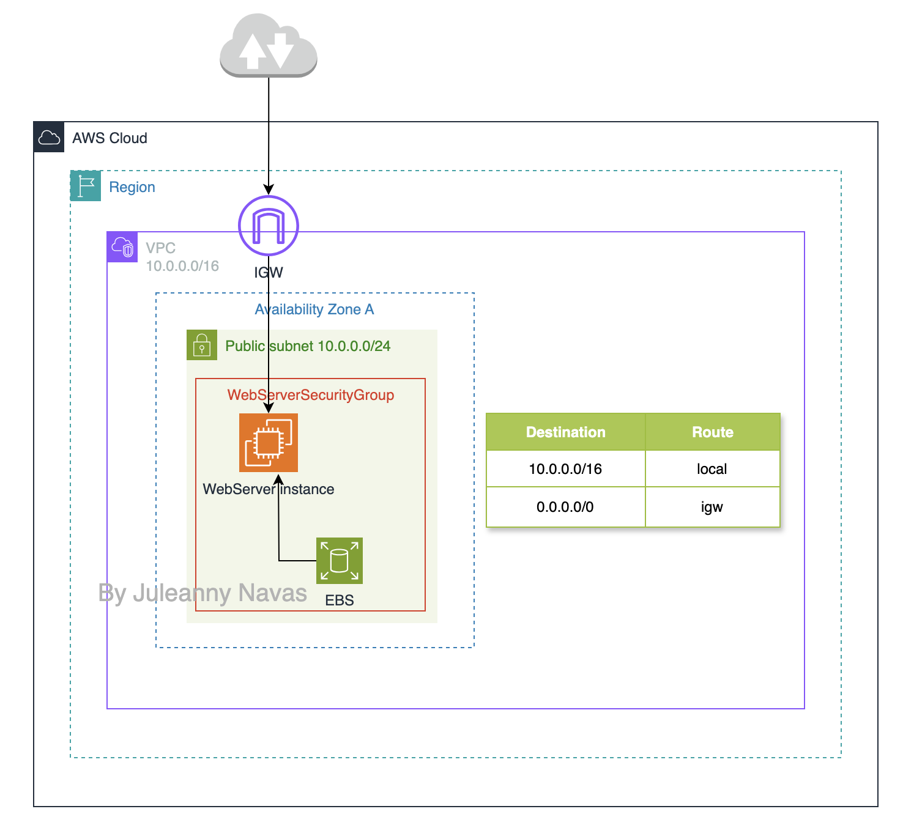

# AWS CloudFormation - Infrastructure Automation #

## Project Description

This project showcases the **automated deployment** of a multi-layer AWS infrastructure using **AWS CloudFormation**, emphasizing best practices in **Infrastructure as Code (IaC)**, security, and resource lifecycle management.

## Key Features

* **Networking Layer** - Provisioned a **VPC** with a **Public Subnet**, Internet gateway **IGW** and **Route Table** to enable external connectivity and proper routing within the VPC.
* **Application Layer** - Deployed an **EC2 instance** with **Apache** installed and configured via **cfn-init** to serve a static website from **/var/www/html** using a pre-defined HTML file delivered through the stack’s metadata configuration..
* **Security Configuration** - Implemented **security group** to allow controlled HTTP and SSH access.
* **Stack Automation** - Used **CloudFormation templates** to automate provisioning, updates, and teardown of infrastructure components.
* **Preservation of Critical Resources** - Applied **deletion policies** to automatically create **Amazon EBS snapshot** before volume deletion.
* **Visual Template Design** - Utilized **Infrastructure Composer** (formerly CloudFormation Designer) to visually explore and validate the resource architecture and relationships.

## Architecture Overview

## Complete Project

## Outcomes

This hands-on project highlights the benefits of **automating cloud deployments** for consistency, security, and scalability. It reflects a **DevOps-oriented approach** by reducing manual configurations and enabling repeatable infrastructure setups that align with modern cloud architecture principles.

## Tools & Services used

* **AWS CloudFormation** – Deploy networking and application infrastructure as code (IaC)
* **Amazon VPC** – Custom virtual network for secure resource isolation
* **AWS Internet Gateway, Route Tables, and Subnets** – Enable external connectivity and routing within the VPC
* **AWS Security Groups** – Firewall rules to control traffic to the instance
* **EC2 instance** – A virtual machine to serve as the application server.
* **AWS Application Composer** – Used to visually explore and understand CloudFormation templates
* **YAML** - Employed as the format for writing human-readable CloudFormation templates
* **Architecture Diagrams** - Visual representation of infrastructure components
(app.diagram.net)
